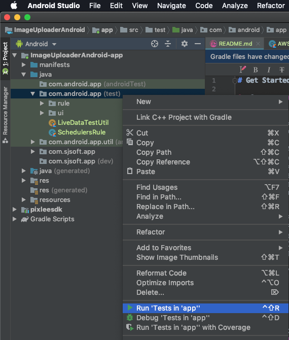

# Demo 
Youtube

[](http://www.youtube.com/watch?v=0gFMnc3a_nY "")

# Get Started

1. Generate **key.properties** in the project folder and fill it with the credentials below: 
```
#Pixlee SDK
pixleeAPIKey={API Key for Pixlee SDK}
pixleeSecretKey={Secret Key for Pixlee SDK}

#PRODUCTION AWS S3
awsAccessKey={Access Key for AWS S3}
awsSecretKey={Secret Key for AWS S3}
awsS3BucketName={S3 bucket name}
awsRegion={region, ex: 'us-east-1' }
s3Domain={domain including bucket name, ex: http://s3.amazonaws.com/sdk-project.pixlee.com/}

#DEVELOPMENT AWS S3
awsAccessKeyForDev={Access Key for AWS S3}
awsSecretKeyForDev={Secret Key for AWS S3}
awsS3BucketNameForDev={S3 bucket name}
awsRegionForDev={region, ex: 'us-east-1' }
s3DomainForDev={domain including bucket name, ex: http://s3.amazonaws.com/sdk-project.pixlee.com/}
```
1. Run the project


# Unit Test
1. Click right button of the mouse on the root of the unit test folder.  
2. Click **Run 'Test in app''**.
3. Check the result if there is any failed test.

